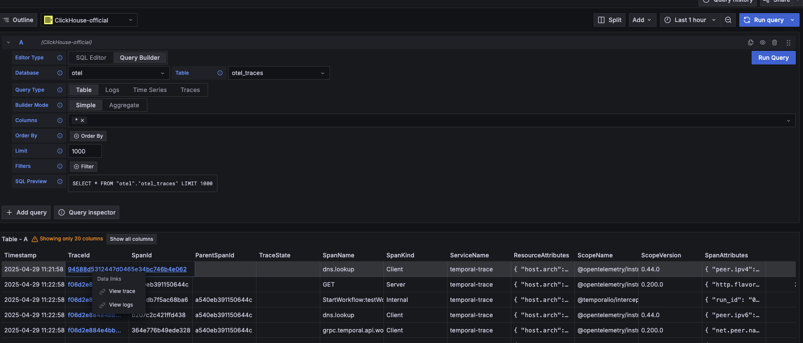

# otel-with-temporal
## This repo helps with visualizing distributed tracing in temporal 

### Steps
1. Run docker container for clickhouse, opentelemetry collector and grafana
```
cd otel-grafana && docker compose up -d
```
This will make sure you local system is ready to receive traces in clickhouse database.

2. Run temporal server in your local machine.  
```
git clone https://github.com/temporalio/docker-compose && cd docker-compose && docker compose up -d
```
Please go through the temporal server github repo once and have a look.

3. Install dependencies
```
1. cd service1 && pnpm install
2. cd instrumentation && pnpm install
```
4. Run services
```
1. cd service1 && npm run start
```

5. Generate traces
```
curl 'http://localhost:5001/generateTrace'
```
6. Visualize traces
Go to http://localhost:3000

